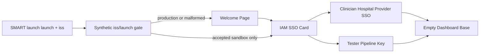

# Frontend Layout Sequence

This branch milestone delivers a single-entry React shell with three sequential screens. Navigation is local component state only. A SMART on FHIR EHR launch can skip the welcome screen after the query string is sanitized.

## 1. Welcome Page

- Centered entry layout.
- Primary heading: `Welcome to Testing App`.
- Context subtitle names the MedTalk Connect FHIR R4 Sandbox.
- `Get Started` advances to login.

## 2. SMART launch intercept

- `useEffect` reads only `launch` and `iss` from the incoming URL.
- All other query keys are discarded and the query string is stripped before any screen change.
- Accepted values must resolve to a synthetic sandbox issuer (`localhost`, `127.0.0.1`, or a host containing `sandbox` / `synthetic`).
- Production clinic hosts and malformed launch tokens are dropped; the user remains on the Welcome Page.
- A valid pair routes directly to the IAM login card for federated sign-on. Raw launch parameters are not rendered on the unauthenticated screen.

## 3. Login View (federated healthcare SSO)

Traditional local username/password fields are not used. The login state is an Identity & Access Management card:

- Header: `MedTalk Identity & Access Management`
- Subtitle: `Secure Health Provider Single Sign-On (SSO)`
- Two side-by-side execution cards:
  - Clinician SSO Gateway — `⚕️ Launch via Hospital Provider` simulates federated login via PRODA / My Health Record or Hospital Active Directory and opens the dashboard as `Dr. Alex Smith`.
  - Developer Harness Access — `🛠️ System Tester Pipeline Key` accepts a masked App Token / Secret Key (`mt_live_xxxx...`). Any non-empty value plus `Verify Key` opens the dashboard with Tester privileges.
- After sign-on, only the already-validated synthetic launch pair may attach to the session.

## 4. Empty Dashboard Base

- Top navigation bar with:
  - Generic app logo mark
  - `AU-Sandbox` pill
  - Logged-in user name
  - `Logout` action
- Main canvas is intentionally empty except a centered card:
  - `Welcome, [User Name]!`
- Logout clears the session, including any SMART launch context, and returns to the Welcome Page.

The empty canvas is the reserved surface for later medical terminology integration grids.

## Backend companion

Short-lived authorization codes and token exchange live in `backend/app/auth_smart.py`. Token responses always inject the synthetic clinic context `patient=PT-AU-94821` and `fhirUser=DrAlexSmith`.
